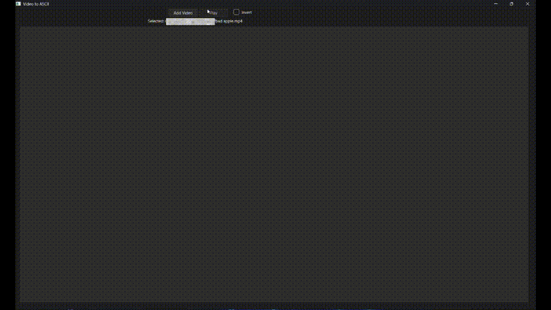

# Video to ASCII (Qt)

A simple application that turns local video files into ascii!

## Features
- Load Videos (mp4, mov, mkv)
- Invert Brightness option
- Pause and Play options
- Plays the audio with the ASCII video

## How it works

The application takes each frame of the video file and converts each pixel's brightness into ASCII characters, mapping dark pixels to dense characters and light ones to sparse characters and vice versa if inverted



## How to use
1. Click "Add Video"
2. Select the video file you want to convert
3. Enable Invert if you want
4. Click Play

## Clone the Repository

```bash
git clone https://github.com/RemTheGem/video-ascii.git
```
